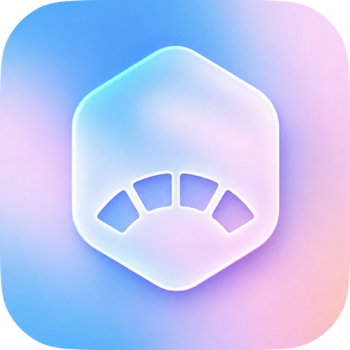
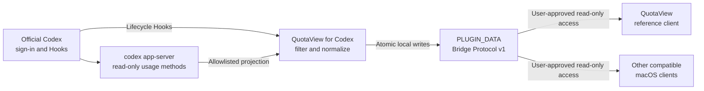
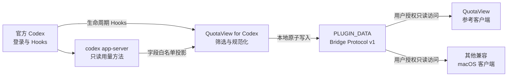

<p align="center">
  
</p>

<h1 align="center">QuotaView for Codex</h1>

<p align="center">
  An open-source, local-first data bridge for sanitized Codex usage and task activity.
</p>

<p align="center">
  <a href="#readme-en">English</a> ·
  <a href="#readme-zh-cn">简体中文</a>
</p>

<a id="readme-en"></a>

## English

## Installation

Regular users do not need to open Terminal or run installation commands manually. Copy the
complete prompt below into a new Codex chat. Codex will use its built-in plugin-management
commands to add this Git Marketplace, install the plugin, and report what still requires your
confirmation.

> QuotaView for Codex is distributed through a third-party custom Git Marketplace. It is not an
> official OpenAI Marketplace listing. Installation never bypasses Codex command approval, Hook
> trust, or the macOS folder picker.

### Step 1: Check the requirements

Before installing, make sure that:

- Codex supports plugins and Hooks;
- you are signed in through the official Codex application;
- you are running macOS 14 or later;
- QuotaView, or another macOS client compatible with Bridge Protocol v1, is installed.

### Step 2: Send the installation prompt to Codex

Copy and send this complete prompt in a new Codex chat:

```text
Install QuotaView for Codex for me directly. Do not only explain the steps, and do not ask me to open Terminal.

Installation targets:
- Git Marketplace: Duoasa/QuotaView-for-Codex
- Plugin: quotaview@quotaview-preview

Execute and verify the installation with these requirements:
1. Use Codex's built-in plugin-management commands to inspect the configured Marketplaces.
2. If this Marketplace is missing, add Duoasa/QuotaView-for-Codex. If it already uses a Git source, refresh its Git Marketplace snapshot. If a local Marketplace with the same name already exists, do not replace it automatically; report that state and ask me whether to keep it or replace it with the Git source.
3. Check whether quotaview@quotaview-preview is already installed. Install it if it is missing. If it is already installed, do not uninstall, reinstall, or delete data; only report its current status and version.
4. Use only commands provided by codex plugin and codex plugin marketplace. Do not edit ~/.codex manually, copy plugin files manually, or bypass Hook trust.
5. After installation, verify that Codex recognizes QuotaView for Codex and report the plugin version. Do not read or print credentials, plugin data contents, or full local paths.
6. Finally, clearly tell me whether installation succeeded, whether Codex must restart, and how to complete Hooks Review / Trust all in Settings after restart. I must personally approve Hook trust.

If command execution or GitHub access requires approval, request that approval directly and wait for me to confirm before continuing.
```

Codex may request permission to execute commands or access GitHub. Approve only after confirming
that it is performing Codex's built-in plugin-management operations. When installation finishes,
quit Codex completely and reopen it.

### Step 3: Trust the Hooks

In Codex:

1. Open `Settings → Plugins → QuotaView for Codex`.
2. Expand `Hooks`.
3. Select `Review`.
4. Select `Trust all`.

If `Trust all` is not available, open `Settings → Hooks` and verify that each Hook is enabled and
marked `trusted`:

- `SessionStart`
- `SessionEnd`
- `UserPromptSubmit`
- `PreToolUse`
- `PostToolUse`
- `Stop`

Quit and reopen Codex once more after trusting the Hooks so `SessionStart` can run.

### Step 4: Connect a client

QuotaView users can send this prompt in Codex:

```text
Connect QuotaView to Codex.
```

Codex runs the plugin's pairing flow and opens QuotaView. In the macOS folder picker, confirm the
`PLUGIN_DATA` folder shown by Codex and grant QuotaView read-only access. Hook trust and folder
access are separate permissions, and both remain under your control.

Other compatible applications can consume the same Bridge Protocol v1 data. Their pairing UI is
client-defined, but the user must explicitly select and authorize the plugin data directory. A
client should never read Codex credentials or modify Codex configuration.

### Step 5: Verify the connection

Start a new Codex task, then check the client for:

- plugin version `1.0.0-preview.7`;
- a new sanitized usage snapshot;
- new lifecycle events;
- a `Stop` event after the task completes.

You can also send:

```text
Check my QuotaView plugin connection.
```

## Overview

QuotaView for Codex is an open-source, local-first, read-only data bridge. It turns two supported
Codex data sources into a small, versioned local contract:

1. the official `codex app-server` supplies read-only account usage summaries; and
2. supported Codex Hooks supply task lifecycle signals.

The plugin filters, normalizes, and writes this information to its own local `PLUGIN_DATA`
directory. QuotaView is the reference client, but it is not the only possible client. Any
compatible macOS application that implements Bridge Protocol v1 and receives explicit folder
access from the user can consume the same data.

The plugin is intentionally a data-provider layer. It does not prescribe how a client should
render quotas, task state, history, notifications, Widgets, menu bar content, or Dynamic Island
experiences.

## Architecture



Codex owns authentication and any network access required by `codex app-server`. The plugin does
not read Codex authentication files, store tokens, or make direct HTTP requests.

## Capabilities

| Capability | What it provides |
|---|---|
| Sanitized usage snapshot | Plan type, primary rate window, used percentage, duration, reset time, normal Credits state, limit state, lifetime tokens, and the newest daily token bucket |
| Task lifecycle stream | `SessionStart`, `SessionEnd`, `UserPromptSubmit`, `PreToolUse`, `PostToolUse`, and `Stop` |
| Automatic refresh | `SessionStart` and `Stop` refresh usage when the previous snapshot is at least five minutes old |
| Explicit refresh | A Codex chat request can ask the plugin to force a fresh sanitized usage snapshot |
| Connection diagnostics | Protocol version, plugin version, local event availability, usage snapshot availability, and authentication ownership |
| Versioned local protocol | Bridge metadata, health state, usage data, and monotonic event envelopes for compatible clients |
| Local retention controls | Events rotate after the newest 512 records; writes use user-only permissions and atomic replacement |

## Interfaces

### 1. Codex chat interface

The recommended way to call the plugin is through natural language in Codex. The bundled Skill
maps the request to the appropriate local bridge action.

| Intent | Example prompt |
|---|---|
| Pair QuotaView | `Connect QuotaView to Codex.` |
| Diagnose the bridge | `Check my QuotaView plugin connection.` |
| Explain stored data | `Explain what QuotaView Codex data stores.` |
| Force a usage refresh | `Refresh my QuotaView usage snapshot now.` |

The pairing flow opens QuotaView and asks the user to confirm the plugin's `PLUGIN_DATA` folder.
Diagnostics report health metadata only; they do not print credentials, file contents, or the full
local data path.

### 2. Hook interface

| Hook | Bridge effect |
|---|---|
| `SessionStart` | Records session start or resume context and may refresh an expired usage snapshot |
| `SessionEnd` | Records that the Codex session ended |
| `UserPromptSubmit` | Records that the user submitted a new turn, without storing prompt text |
| `PreToolUse` | Records a coarse tool category before execution |
| `PostToolUse` | Records a coarse tool category after execution |
| `Stop` | Records task completion, returns the supported empty JSON Hook result, and may refresh usage |

Tool names are reduced to `shell`, `fileEdit`, `mcp`, `subagent`, `localTool`, or `unknown` before
they are written. Tool input, tool output, commands, and file paths are never copied into events.

### 3. Read-only app-server interface

The plugin launches the official local `codex app-server` process and calls only these methods:

| Method | Allowlisted output used by the plugin |
|---|---|
| `account/rateLimits/read` | Plan type, primary window percentage/duration/reset time, normal Credits flags and balance, and whether a limit was reached |
| `account/usage/read` | Lifetime token total and the newest daily token bucket |

These are plugin-to-Codex local calls, not public HTTP endpoints. Raw app-server responses are not
persisted.

### 4. Local bridge command interface

These commands are normally invoked by the bundled Skill or Hooks inside the Codex plugin context:

| Action | Bridge argument | Behavior |
|---|---|---|
| Pair QuotaView | `--pair` | Initializes bridge metadata, refreshes usage when possible, and opens the QuotaView pairing URL |
| Diagnose | `--diagnose` | Reports protocol/plugin versions and whether events and usage are available |
| Refresh usage | `--refresh-usage` | Requests an allowlisted usage snapshot; the Skill sets the force flag for an immediate refresh |
| Record lifecycle | Hook name | Writes one sanitized, monotonic event envelope |

Normal users should prefer the Codex chat interface. Developers working inside an active plugin
context can invoke the bridge without resolving or hard-coding its installation path:

```sh
"${PLUGIN_ROOT:-${CODEX_PLUGIN_ROOT:-${CLAUDE_PLUGIN_ROOT}}}/scripts/quotaview-bridge" --diagnose
```

To explicitly bypass the five-minute refresh window for one request:

```sh
QUOTAVIEW_USAGE_REFRESH_FORCE=1 \
"${PLUGIN_ROOT:-${CODEX_PLUGIN_ROOT:-${CLAUDE_PLUGIN_ROOT}}}/scripts/quotaview-bridge" --refresh-usage
```

## Local data contract

The plugin writes only inside its own `PLUGIN_DATA` directory:

| File | Purpose |
|---|---|
| `bridge.json` | Plugin identity, protocol versions, installation identity, creation time, and capabilities |
| `status.json` | Latest successful event write, newest sequence, and bounded diagnostic state |
| `usage.json` | Allowlisted usage snapshot from the official Codex app-server |
| `events/*.json` | Immutable, zero-padded, monotonically increasing lifecycle event envelopes |

### `bridge.json`

| Field | Meaning |
|---|---|
| `pluginId` | Stable Bridge v1 plugin identifier (`quotaview`) |
| `pluginVersion` | Installed plugin version |
| `distributionChannel` | Current distribution source, such as `git-marketplace` |
| `bridgeProtocolVersion` | Local bridge protocol version |
| `eventSchemaVersion` | Lifecycle event schema version |
| `installationIdentifier` | Random identifier scoped to this plugin data installation |
| `createdAt` | UTC creation timestamp retained across compatible plugin updates |
| `capabilities` | Currently `codex-activity-events` and `codex-usage-snapshot` |

### `usage.json`

| Field group | Allowlisted data |
|---|---|
| Identity | `bridgeProtocolVersion`, `installationIdentifier`, `usageSchemaVersion` |
| Capture metadata | `capturedAt`, `source` (`codex-app-server`) |
| Plan | `planType` |
| Primary window | `usedPercent`, `windowDurationMins`, `resetsAt` |
| Credits | `hasCredits`, `unlimited`, `balance` when supplied by Codex |
| Limit state | `limitReached` |
| Token summary | `lifetimeTokens`, `recentDailyTokens`, `recentDailyDate` |

### `status.json`

| Field | Meaning |
|---|---|
| `bridgeProtocolVersion` | Protocol version used by the writer |
| `installationIdentifier` | Installation that owns the event stream |
| `latestSequence` | Newest successfully written event sequence |
| `lastSuccessfulWriteAt` | UTC timestamp of the newest event write |
| `diagnosticStatus` | Bounded bridge health value, currently `ok` after a successful write |

### Lifecycle event envelope

| Field | Meaning |
|---|---|
| `bridgeProtocolVersion` | Protocol version for this envelope |
| `installationIdentifier` | Installation that produced the event |
| `sequence` | Monotonically increasing event number |
| `activity.schemaVersion` | Activity payload schema version |
| `activity.event` | One of the six supported lifecycle events |
| `activity.sessionHash` | One-way hash of the source session identifier |
| `activity.turnHash` | Optional one-way hash of the source turn identifier |
| `activity.workspaceName` | Final workspace folder name only, capped at 80 characters |
| `activity.toolCategory` | Optional coarse tool category |
| `activity.sessionStartSource` | `startup`, `resume`, `clear`, or `compact` when available |
| `activity.occurredAt` | UTC event timestamp |

## Integrating another client

Bridge Protocol v1 is designed for local, read-only macOS clients. A compatible client should:

1. ask the user to select and authorize the plugin's `PLUGIN_DATA` directory;
2. validate `bridge.json`, supported protocol/schema versions, installation identity, and required
   capabilities;
3. read `usage.json` only when its installation identity matches `bridge.json`;
4. read `status.json` and consume event files in sequence order;
5. persist a client-side cursor consisting of `installationIdentifier + sequence`;
6. reset its cursor when the installation identifier changes;
7. bound file sizes, timestamp skew, stale data, unknown schemas, and missing rotated events;
8. never write to, delete from, or change permissions inside `PLUGIN_DATA`.

The custom `quotaview://pair` URL is specific to the QuotaView reference client. Other clients can
implement their own pairing UI while consuming the same local file contract.

## Refresh and lifecycle behavior

- The default usage refresh interval is five minutes.
- `SessionStart` and `Stop` perform the refresh in-process when the previous snapshot is old enough.
- Frequent lifecycle events share the same five-minute window instead of launching duplicate
  app-server work.
- An explicit force-refresh request bypasses the age check for that request.
- Bridge failures are fail-open: they must not block or continue a Codex task.
- Event writes happen before the optional usage refresh so task completion is not lost when usage
  retrieval is slow.

## Privacy and security

The plugin stores only the fields documented above. It does **not** store:

- prompt text or model responses;
- reasoning or conversation content;
- commands, tool input, or tool output;
- full workspace paths or file contents;
- account identifiers or email addresses;
- access tokens, cookies, credentials, or Codex authentication files;
- reset-credit inventory or raw app-server responses.

Additional safeguards:

- Codex remains responsible for sign-in and network access.
- The plugin makes no direct HTTP requests.
- Data directories use user-only permissions; files are written through atomic replacement.
- Lifecycle events are bounded to the newest 512 records.
- Hook trust is never bypassed.
- Client access requires an explicit macOS folder selection.

See [PRIVACY.md](PRIVACY.md) and [SECURITY.md](SECURITY.md).

## Uninstall

1. Disconnect the plugin data directory in QuotaView or another client.
2. Disable or uninstall `quotaview` in Codex.
3. Do not manually delete the plugin data directory unless you have separately decided that the
   retained local data is no longer needed.

The plugin does not delete its data directory, modify unrelated Codex settings, or inspect
QuotaView purchase state.

## Development and validation

The repository includes deterministic bridge and isolated installation checks:

```sh
python3 -m json.tool plugins/quotaview/.codex-plugin/plugin.json >/dev/null
python3 -m json.tool plugins/quotaview/hooks.json >/dev/null
python3 -m json.tool .agents/plugins/marketplace.json >/dev/null
zsh -n plugins/quotaview/scripts/quotaview-bridge tests/test-bridge.zsh
zsh tests/test-bridge.zsh
zsh scripts/check-clean-install.zsh
git diff --check
```

See [RELEASING.md](RELEASING.md) for immutable tags, deterministic source assets, release checks,
and public artifact verification.

## License

Released under the [MIT License](LICENSE).

<p align="right"><a href="#readme-en">Back to English top</a> · <a href="#readme-zh-cn">简体中文</a></p>

---

<a id="readme-zh-cn"></a>

## 简体中文

## 安装

普通用户不需要打开终端或手动执行安装命令。将下面的完整提示词复制到一个新的 Codex
聊天窗口，Codex 会使用内置插件管理命令添加 Git Marketplace、安装插件，并告诉你仍需
亲自确认的步骤。

> QuotaView for Codex 通过第三方自定义 Git Marketplace 分发，并非 OpenAI 官方插件市场
> 条目。安装不会绕过 Codex 命令审批、Hooks 信任或 macOS 目录选择器。

### 第 1 步：确认运行环境

安装前请确认：

- Codex 支持插件与 Hooks；
- 已通过 Codex 官方应用完成登录；
- 使用 macOS 14 或更高版本；
- 已安装 QuotaView，或其他兼容 Bridge Protocol v1 的 macOS 客户端。

### 第 2 步：将安装提示词发送给 Codex

复制下面的完整提示词，粘贴到新的 Codex 聊天窗口并发送：

```text
请直接帮我安装 QuotaView for Codex 插件，不要只提供操作说明，也不要让我打开终端。

安装目标：
- Git Marketplace：Duoasa/QuotaView-for-Codex
- 插件：quotaview@quotaview-preview

请按以下要求执行并验证：
1. 使用 Codex 内置的插件管理命令检查当前已经配置的 Marketplace。
2. 如果尚未配置此 Marketplace，添加 Duoasa/QuotaView-for-Codex；如果已经配置为 Git 来源，刷新它的 Git Marketplace 快照；如果同名 Marketplace 当前来自本地目录，不要自动覆盖，先报告当前状态并询问我是保留本地来源还是替换为 Git 来源。
3. 检查 quotaview@quotaview-preview 是否已经安装。如果尚未安装，直接安装；如果已经安装，不要卸载、重装或删除数据，只报告当前状态和版本。
4. 只使用 codex plugin 与 codex plugin marketplace 提供的命令。不要手工编辑 ~/.codex，不要手动复制插件文件，也不要绕过 Hooks 信任。
5. 安装后确认 Codex 能识别 QuotaView for Codex，并报告插件版本。不要读取或输出登录凭据、插件数据内容或完整本地路径。
6. 最后明确告诉我安装是否成功、是否需要重启 Codex，以及重启后如何在设置中完成 Hooks 的 Review / Trust all。Hooks 信任必须由我本人确认。

如果执行命令或访问 GitHub 需要授权，请直接发起对应的授权请求，等待我确认后继续。
```

Codex 可能会申请命令执行或 GitHub 访问权限。确认它正在执行 Codex 自带的插件管理操作
后，再批准并让它继续。安装完成后，完全退出并重新打开 Codex。

### 第 3 步：授权 Hooks

在 Codex 中：

1. 打开 `设置 → 插件 → QuotaView for Codex`；
2. 展开 `Hooks`；
3. 点击 `检查 / Review`；
4. 选择 `全部信任 / Trust all`。

如果没有看到“全部信任”，请进入 `设置 → Hooks`，确认以下 Hook 均已启用并显示为
`trusted`：

- `SessionStart`
- `SessionEnd`
- `UserPromptSubmit`
- `PreToolUse`
- `PostToolUse`
- `Stop`

授权完成后，再次完全退出并重新打开 Codex，使 `SessionStart` 生效。

### 第 4 步：连接客户端

QuotaView 用户可以在 Codex 中发送：

```text
Connect QuotaView to Codex.
```

Codex 会执行插件的配对流程并打开 QuotaView。请在 macOS 文件选择器中确认 Codex 显示
的 `PLUGIN_DATA` 文件夹，只授予 QuotaView 只读访问权限。Hooks 信任和目录访问是两项
独立权限，都必须由你本人确认。

其他兼容软件也可以消费 Bridge Protocol v1 数据。具体配对界面由客户端实现，但用户
必须明确选择并授权插件数据目录。客户端不应读取 Codex 凭据或修改 Codex 配置。

### 第 5 步：确认连接

在 Codex 中开始一个新任务，随后在客户端检查：

- 插件版本是否显示为 `1.0.0-preview.7`；
- 是否收到新的脱敏用量快照；
- 是否出现新的生命周期事件；
- 任务结束后是否收到 `Stop`。

也可以在 Codex 中发送：

```text
Check my QuotaView plugin connection.
```

## 插件概览

QuotaView for Codex 是一个开源、本地优先、只读的数据桥。它把两类 Codex 数据源转换为
小型、版本化的本地数据合同：

1. 官方 `codex app-server` 提供只读账号用量摘要；
2. Codex 支持的 Hooks 提供任务生命周期信号。

插件会筛选、规范化这些信息，并写入自己的本地 `PLUGIN_DATA` 目录。QuotaView 是参考
客户端，但不是唯一客户端。任何实现 Bridge Protocol v1、并获得用户明确目录授权的
兼容 macOS 应用，都可以消费同一份数据。

插件只承担数据提供层职责，不规定客户端必须如何展示额度、任务状态、历史、通知、
Widget、菜单栏或灵动岛体验。

## 架构



Codex 负责登录以及 `codex app-server` 所需的网络访问。插件不读取 Codex 认证文件、不保存
Token，也不直接发起 HTTP 请求。

## 核心能力

| 能力 | 提供内容 |
|---|---|
| 脱敏用量快照 | 方案类型、主要额度窗口、已用比例、窗口时长、重置时间、普通 Credits 状态、限制状态、累计 Token 和最新每日 Token 桶 |
| 任务生命周期流 | `SessionStart`、`SessionEnd`、`UserPromptSubmit`、`PreToolUse`、`PostToolUse` 和 `Stop` |
| 自动刷新 | 当上一份快照至少已有五分钟时，`SessionStart` 与 `Stop` 刷新用量 |
| 明确强制刷新 | 用户可以通过 Codex 聊天要求插件立即请求新的脱敏用量快照 |
| 连接诊断 | 协议版本、插件版本、本地事件状态、用量快照状态和认证归属 |
| 版本化本地协议 | 面向兼容客户端的桥接元数据、健康状态、用量数据和单调事件信封 |
| 本地保留控制 | 事件只保留最新 512 条；数据使用仅用户可访问权限和原子替换 |

## 接口

### 1. Codex 聊天接口

推荐通过 Codex 自然语言调用插件。插件内置 Skill 会把请求映射到对应的本地桥接操作。

| 目的 | 示例提示词 |
|---|---|
| 配对 QuotaView | `Connect QuotaView to Codex.` |
| 诊断连接 | `Check my QuotaView plugin connection.` |
| 解释本地数据 | `Explain what QuotaView Codex data stores.` |
| 强制刷新用量 | `Refresh my QuotaView usage snapshot now.` |

配对流程会打开 QuotaView，并要求用户确认插件 `PLUGIN_DATA` 文件夹。诊断只报告健康
元数据，不输出凭据、文件内容或完整本地数据路径。

### 2. Hooks 接口

| Hook | 桥接行为 |
|---|---|
| `SessionStart` | 记录会话启动或恢复上下文，并可能刷新过期用量快照 |
| `SessionEnd` | 记录 Codex 会话结束 |
| `UserPromptSubmit` | 记录用户提交了新的 Turn，但不保存提示词正文 |
| `PreToolUse` | 工具执行前记录粗粒度工具类别 |
| `PostToolUse` | 工具执行后记录粗粒度工具类别 |
| `Stop` | 记录任务完成，返回受支持的空 JSON Hook 结果，并可能刷新用量 |

工具名称在写入前会被归并为 `shell`、`fileEdit`、`mcp`、`subagent`、`localTool` 或
`unknown`。插件不会复制工具输入输出、命令或文件路径。

### 3. 只读 app-server 接口

插件只会启动官方本地 `codex app-server` 进程并调用以下方法：

| 方法 | 插件使用的白名单输出 |
|---|---|
| `account/rateLimits/read` | 方案类型、主要窗口比例/时长/重置时间、普通 Credits 标记与余额，以及是否触达限制 |
| `account/usage/read` | 累计 Token 和最新每日 Token 桶 |

这些是插件到 Codex 的本地调用，不是公开 HTTP 接口。原始 app-server 响应不会落盘。

### 4. 本地 Bridge 命令接口

这些命令通常由插件 Skill 或 Hooks 在 Codex 插件上下文中调用：

| 操作 | Bridge 参数 | 行为 |
|---|---|---|
| 配对 QuotaView | `--pair` | 初始化桥接元数据、尽可能刷新用量并打开 QuotaView 配对 URL |
| 诊断 | `--diagnose` | 报告协议/插件版本，以及事件和用量是否可用 |
| 刷新用量 | `--refresh-usage` | 请求字段白名单用量快照；Skill 会设置强制标记以立即刷新 |
| 写入生命周期 | Hook 名称 | 写入一条脱敏、单调递增的事件信封 |

普通用户应优先使用 Codex 聊天接口。在有效插件上下文中，开发者可以不解析或硬编码插件
安装路径，直接调用：

```sh
"${PLUGIN_ROOT:-${CODEX_PLUGIN_ROOT:-${CLAUDE_PLUGIN_ROOT}}}/scripts/quotaview-bridge" --diagnose
```

如需仅对本次请求跳过五分钟刷新窗口：

```sh
QUOTAVIEW_USAGE_REFRESH_FORCE=1 \
"${PLUGIN_ROOT:-${CODEX_PLUGIN_ROOT:-${CLAUDE_PLUGIN_ROOT}}}/scripts/quotaview-bridge" --refresh-usage
```

## 本地数据合同

插件只会在自己的 `PLUGIN_DATA` 目录内写入：

| 文件 | 用途 |
|---|---|
| `bridge.json` | 插件身份、协议版本、安装身份、创建时间和能力声明 |
| `status.json` | 最近成功事件写入、最新序号和有界诊断状态 |
| `usage.json` | 来自官方 Codex app-server 的字段白名单用量快照 |
| `events/*.json` | 不可变、补零命名、单调递增的生命周期事件信封 |

### `bridge.json`

| 字段 | 含义 |
|---|---|
| `pluginId` | Bridge v1 稳定插件标识（`quotaview`） |
| `pluginVersion` | 已安装插件版本 |
| `distributionChannel` | 当前分发来源，例如 `git-marketplace` |
| `bridgeProtocolVersion` | 本地桥接协议版本 |
| `eventSchemaVersion` | 生命周期事件结构版本 |
| `installationIdentifier` | 仅属于当前插件数据安装实例的随机标识 |
| `createdAt` | 兼容插件更新之间保留的 UTC 创建时间 |
| `capabilities` | 当前为 `codex-activity-events` 与 `codex-usage-snapshot` |

### `usage.json`

| 字段组 | 白名单数据 |
|---|---|
| 身份 | `bridgeProtocolVersion`、`installationIdentifier`、`usageSchemaVersion` |
| 采集元数据 | `capturedAt`、`source`（`codex-app-server`） |
| 方案 | `planType` |
| 主要窗口 | `usedPercent`、`windowDurationMins`、`resetsAt` |
| Credits | Codex 提供时的 `hasCredits`、`unlimited`、`balance` |
| 限制状态 | `limitReached` |
| Token 摘要 | `lifetimeTokens`、`recentDailyTokens`、`recentDailyDate` |

### `status.json`

| 字段 | 含义 |
|---|---|
| `bridgeProtocolVersion` | Writer 使用的协议版本 |
| `installationIdentifier` | 事件流所属安装实例 |
| `latestSequence` | 最近成功写入的事件序号 |
| `lastSuccessfulWriteAt` | 最近事件写入的 UTC 时间 |
| `diagnosticStatus` | 有界桥接健康值，成功写入后当前为 `ok` |

### 生命周期事件信封

| 字段 | 含义 |
|---|---|
| `bridgeProtocolVersion` | 当前信封的协议版本 |
| `installationIdentifier` | 产生事件的安装实例 |
| `sequence` | 单调递增事件序号 |
| `activity.schemaVersion` | 活动载荷结构版本 |
| `activity.event` | 六种受支持生命周期事件之一 |
| `activity.sessionHash` | 源会话标识的单向哈希 |
| `activity.turnHash` | 可选的源 Turn 标识单向哈希 |
| `activity.workspaceName` | 仅工作区末级文件夹名，最长 80 字符 |
| `activity.toolCategory` | 可选粗粒度工具类别 |
| `activity.sessionStartSource` | 可用时为 `startup`、`resume`、`clear` 或 `compact` |
| `activity.occurredAt` | UTC 事件时间 |

## 接入其他客户端

Bridge Protocol v1 面向本地、只读 macOS 客户端。兼容客户端应当：

1. 要求用户选择并授权插件 `PLUGIN_DATA` 目录；
2. 校验 `bridge.json`、支持的协议/结构版本、安装身份和必要能力；
3. 仅在安装身份与 `bridge.json` 一致时读取 `usage.json`；
4. 读取 `status.json`，并按序号消费事件文件；
5. 在客户端保存由 `installationIdentifier + sequence` 组成的游标；
6. 安装身份变化时重置游标；
7. 对文件大小、时间偏移、过期数据、未知结构和已轮转缺失事件设置安全边界；
8. 不得写入、删除或修改 `PLUGIN_DATA` 中的权限。

自定义 `quotaview://pair` URL 只属于 QuotaView 参考客户端。其他客户端可以自行实现配对
界面，同时继续消费相同的本地文件合同。

## 刷新与生命周期行为

- 默认用量刷新间隔为五分钟。
- 当上一份快照足够旧时，`SessionStart` 和 `Stop` 在当前进程内执行刷新。
- 高频生命周期事件共用五分钟窗口，不重复启动 app-server 工作。
- 明确的强制刷新请求会仅对本次请求跳过快照年龄检查。
- Bridge 采用 fail-open：自身故障不得阻塞或要求继续 Codex 任务。
- 事件先于可选用量刷新写入，避免用量读取缓慢导致任务结束事件丢失。

## 隐私与安全

插件只保存上文列出的字段，**不会**保存：

- 提示词正文或模型回复；
- 推理或对话内容；
- 命令、工具输入或工具输出；
- 完整工作区路径或文件内容；
- 账号标识或邮箱；
- Access Token、Cookie、凭据或 Codex 认证文件；
- 重置额度库存或原始 app-server 响应。

其他保护措施：

- Codex 始终负责登录与网络访问；
- 插件不直接发起 HTTP 请求；
- 数据目录仅当前用户可访问，文件通过原子替换写入；
- 生命周期事件只保留最新 512 条；
- Hooks 信任不会被绕过；
- 客户端必须通过 macOS 目录选择器获得用户明确授权。

详见 [PRIVACY.md](PRIVACY.md) 和 [SECURITY.md](SECURITY.md)。

## 卸载

1. 先在 QuotaView 或其他客户端中断开插件数据目录；
2. 再在 Codex 中禁用或卸载 `quotaview`；
3. 除非你已经单独决定不再需要保留的本地数据，否则不要手工删除插件数据目录。

插件不会代替用户删除数据目录、修改其他 Codex 设置，也不会检查 QuotaView 购买状态。

## 开发与验证

仓库包含确定性的 Bridge 测试和隔离安装检查：

```sh
python3 -m json.tool plugins/quotaview/.codex-plugin/plugin.json >/dev/null
python3 -m json.tool plugins/quotaview/hooks.json >/dev/null
python3 -m json.tool .agents/plugins/marketplace.json >/dev/null
zsh -n plugins/quotaview/scripts/quotaview-bridge tests/test-bridge.zsh
zsh tests/test-bridge.zsh
zsh scripts/check-clean-install.zsh
git diff --check
```

不可变 Tag、确定性源码资产、发布检查和公开资产复验流程见
[RELEASING.md](RELEASING.md)。

## 许可证

基于 [MIT License](LICENSE) 发布。

<p align="right"><a href="#readme-zh-cn">返回中文顶部</a> · <a href="#readme-en">English</a></p>
