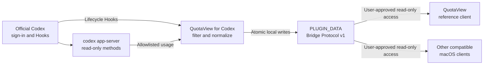

<p align="center">
  
</p>

<h1 align="center">QuotaView for Codex</h1>

<p align="center">
  An open-source, local-first bridge for sanitized Codex usage and live task activity.
</p>

<p align="center">
  <a href="https://github.com/Duoasa/QuotaView-for-Codex/releases/tag/v1.0.0-preview.7"></a>
  <a href="https://github.com/Duoasa/QuotaView-for-Codex/actions/workflows/test.yml"></a>
  
  <a href="LICENSE"></a>
</p>

<p align="center">
  <a href="#installation"><strong>Install with Codex</strong></a>
  ·
  <a href="https://github.com/Duoasa/QuotaView-for-Codex/releases/tag/v1.0.0-preview.7">Preview 7 release</a>
  ·
  <a href="#privacy-by-design">Privacy</a>
  ·
  <a href="#client-integration">Build a client</a>
</p>

<p align="center">
  <strong>English</strong> · <a href="README.zh-CN.md">简体中文</a>
</p>

<a id="installation"></a>

## Installation

Regular users do not need to open Terminal. Copy the complete prompt below into a new Codex chat;
Codex will use its built-in plugin-management commands to add this Git Marketplace, install the
plugin, and report the remaining user confirmations.

> [!IMPORTANT]
> This project is distributed through a third-party custom Git Marketplace, not the official
> OpenAI Marketplace. Installation never bypasses command approval, Hook trust, or the macOS
> folder picker.

### 1. Check the requirements

- Codex with plugin and Hooks support
- An official Codex sign-in
- macOS 14 or later
- QuotaView, or another macOS client compatible with Bridge Protocol v1

### 2. Send the installation prompt

```text
Install QuotaView for Codex for me directly. Do not only explain the steps, and do not ask me to open Terminal.

Installation targets:
- Git Marketplace: Duoasa/QuotaView-for-Codex
- Plugin: quotaview@quotaview-preview

Execute and verify the installation with these requirements:
1. Use Codex's built-in plugin-management commands to inspect the configured Marketplaces.
2. If this Marketplace is missing, add Duoasa/QuotaView-for-Codex. If it already uses a Git source, refresh its Git Marketplace snapshot. If a local Marketplace with the same name already exists, do not replace it automatically; report that state and ask me whether to keep it or replace it with the Git source.
3. Check whether quotaview@quotaview-preview is already installed. Install it if it is missing. If it is already installed, do not uninstall, reinstall, or delete data; only report its current status and version.
4. Use only commands provided by codex plugin and codex plugin marketplace. Do not edit ~/.codex manually, copy plugin files manually, or bypass Hook trust.
5. After installation, verify that Codex recognizes QuotaView for Codex and report the plugin version. Do not read or print credentials, plugin data contents, or full local paths.
6. Finally, clearly tell me whether installation succeeded, whether Codex must restart, and how to complete Hooks Review / Trust all in Settings after restart. I must personally approve Hook trust.

If command execution or GitHub access requires approval, request that approval directly and wait for me to confirm before continuing.
```

Approve only Codex's built-in plugin-management operations. When installation finishes, quit
Codex completely and reopen it.

### 3. Trust the Hooks

Open `Settings → Plugins → QuotaView for Codex`, expand `Hooks`, select `Review`, then select
`Trust all`. If the combined action is unavailable, open `Settings → Hooks` and verify that these
Hooks are enabled and marked `trusted`:

`SessionStart` · `SessionEnd` · `UserPromptSubmit` · `PreToolUse` · `PostToolUse` · `Stop`

Quit and reopen Codex once more so the trusted `SessionStart` Hook can run.

### 4. Connect a client

QuotaView users can send:

```text
Connect QuotaView to Codex.
```

The plugin opens QuotaView's pairing flow. Confirm the `PLUGIN_DATA` folder in the macOS folder
picker and grant QuotaView read-only access. Hook trust and folder access are separate permissions;
both remain under the user's control.

### 5. Verify the connection

Start a new Codex task and confirm that the client receives plugin version `1.0.0-preview.7`, a
sanitized usage snapshot, lifecycle events, and a final `Stop` event. You can also send:

```text
Check my QuotaView plugin connection.
```

> [!NOTE]
> QuotaView is the reference client. Other applications can implement their own pairing UI and
> consume the same Bridge Protocol v1 data after the user grants read-only folder access.

## Why QuotaView for Codex

QuotaView for Codex turns supported Codex usage summaries and lifecycle Hooks into a small,
versioned local contract. It produces data without dictating how a client must present it.

| | |
| --- | --- |
| **Local-first** | Writes a bounded data set to the plugin's own `PLUGIN_DATA` directory; no cloud relay or external service is required. |
| **Read-only by design** | Uses only two read methods from the official local `codex app-server` and never modifies the Codex account. |
| **Live task activity** | Publishes sanitized task lifecycle events for status surfaces, notifications, menu bar tools, Widgets, and Dynamic Island experiences. |
| **Client-neutral protocol** | QuotaView is the reference implementation, while any compatible macOS client can consume Bridge Protocol v1. |
| **Privacy-preserving** | Excludes prompts, commands, tool input/output, file contents, model responses, reasoning, credentials, and raw server responses. |
| **Fail-open** | Bridge failures never block a Codex task or request model continuation. |

## How it works



Codex owns authentication and any network access used by `codex app-server`. The plugin does not
read authentication files, store tokens, or make direct HTTP requests.

## Data provided

| Data group | Allowlisted fields | Source |
| --- | --- | --- |
| Plan and rate window | Plan type, used percentage, window duration, reset time | `account/rateLimits/read` |
| Credits and limits | `hasCredits`, `unlimited`, balance, limit-reached state | `account/rateLimits/read` |
| Token summary | Lifetime tokens and the newest daily token bucket | `account/usage/read` |
| Lifecycle | Event type, UTC time, protocol/schema versions, monotonic sequence | Codex Hooks |
| Activity context | One-way session/turn hashes, final workspace folder name, coarse tool category, session-start source | Codex Hooks |
| Bridge health | Plugin/protocol versions, installation identity, capabilities, latest write and sequence | Local bridge |

Lifecycle events rotate after the newest 512 records. Workspace data is limited to the final
folder name and capped at 80 characters. Tool names are reduced to `shell`, `fileEdit`, `mcp`,
`subagent`, `localTool`, or `unknown` before they are written.

## Interfaces

### Codex Hooks

| Hook | Bridge effect |
| --- | --- |
| `SessionStart` | Records startup or resume context and may refresh an expired usage snapshot |
| `SessionEnd` | Records that the Codex session ended |
| `UserPromptSubmit` | Records a new turn without copying prompt text |
| `PreToolUse` | Records a coarse tool category before execution |
| `PostToolUse` | Records a coarse tool category after execution |
| `Stop` | Records completion, returns the supported empty JSON Hook result, and may refresh usage |

### Read-only app-server methods

| Method | Purpose |
| --- | --- |
| `account/rateLimits/read` | Supplies the allowlisted plan, rate-window, Credits, and limit fields |
| `account/usage/read` | Supplies lifetime tokens and the newest daily token bucket |

These are local plugin-to-Codex calls, not public HTTP endpoints. Raw responses are never
persisted.

### Bridge actions

| Action | Argument | Behavior |
| --- | --- | --- |
| Pair QuotaView | `--pair` | Initializes metadata, refreshes usage when possible, and opens QuotaView's pairing URL |
| Diagnose | `--diagnose` | Reports protocol/plugin versions and whether local events and usage are available |
| Refresh usage | `--refresh-usage` | Requests a new allowlisted snapshot; the bundled Skill can force immediate refresh |
| Record lifecycle | Hook name | Writes one sanitized, monotonic event envelope |

## Calling the plugin

The recommended interface is natural language in Codex:

| Intent | Example prompt |
| --- | --- |
| Pair QuotaView | `Connect QuotaView to Codex.` |
| Diagnose | `Check my QuotaView plugin connection.` |
| Explain local data | `Explain what QuotaView Codex data stores.` |
| Force usage refresh | `Refresh my QuotaView usage snapshot now.` |

Developers working inside an active plugin context can invoke the bridge without hard-coding its
installation path:

```sh
"${PLUGIN_ROOT:-${CODEX_PLUGIN_ROOT:-${CLAUDE_PLUGIN_ROOT}}}/scripts/quotaview-bridge" --diagnose
```

To explicitly bypass the five-minute refresh window for one request:

```sh
QUOTAVIEW_USAGE_REFRESH_FORCE=1 \
"${PLUGIN_ROOT:-${CODEX_PLUGIN_ROOT:-${CLAUDE_PLUGIN_ROOT}}}/scripts/quotaview-bridge" --refresh-usage
```

## Local data protocol

The plugin writes only inside its own `PLUGIN_DATA` directory:

| File | Key fields | Consumer notes |
| --- | --- | --- |
| `bridge.json` | `pluginId`, plugin/protocol/schema versions, `installationIdentifier`, `createdAt`, capabilities | Validate first; current capabilities are `codex-activity-events` and `codex-usage-snapshot` |
| `usage.json` | Capture time/source, plan, primary window, Credits, limit state, token summary | Consume only when protocol and installation identity match `bridge.json` |
| `status.json` | Protocol, installation identity, `latestSequence`, latest successful write, diagnostic state | Use to discover the newest event and bridge health |
| `events/*.json` | Protocol, installation identity, sequence, sanitized activity payload | Immutable, zero-padded, monotonically increasing; newest 512 retained |

Every usage, status, and event record is tied to the random `installationIdentifier` published by
`bridge.json`. Compatible clients should keep a local `installationIdentifier + sequence` cursor
and reset it when the installation identity changes.

<a id="client-integration"></a>

## Client integration

A Bridge Protocol v1 client should:

1. ask the user to select and authorize the plugin's `PLUGIN_DATA` directory;
2. validate `bridge.json`, supported protocol/schema versions, installation identity, and required
   capabilities;
3. read `usage.json` only when its installation identity matches the bridge manifest;
4. read `status.json` and consume event files in sequence order;
5. store its cursor in the client, never in the plugin directory;
6. reset state when the installation identity changes;
7. bound file sizes, timestamp skew, stale data, unknown schemas, and missing rotated events;
8. never write to, delete from, or change permissions inside `PLUGIN_DATA`.

The `quotaview://pair` URL belongs to the QuotaView reference client. Other clients can implement
their own pairing UI while consuming the same local file contract.

## Refresh behavior

- The default usage refresh interval is five minutes.
- `SessionStart` and `Stop` refresh in-process when the previous snapshot is old enough.
- Frequent lifecycle events share the same refresh window instead of duplicating app-server work.
- Explicit force refresh bypasses the age check for one request.
- Event writes happen before optional usage refresh so slow usage retrieval cannot erase completion.

<a id="privacy-by-design"></a>

## Privacy by design

The plugin does **not** store:

- prompt text, conversation content, model responses, or reasoning;
- commands, tool input, tool output, full paths, or file contents;
- account identifiers, email addresses, tokens, cookies, credentials, or authentication files;
- reset-credit inventory or raw app-server responses.

Data directories use user-only permissions and atomic file replacement. Hook trust is never
bypassed, and client access requires explicit macOS folder authorization. See
[PRIVACY.md](PRIVACY.md) and [SECURITY.md](SECURITY.md).

## Requirements and limitations

- macOS 14 or later
- Codex with plugins, Hooks, and local `codex app-server` support
- Official Codex sign-in for usage snapshots
- Bridge Protocol v1 currently targets local read-only macOS clients
- QuotaView pairing uses the QuotaView-specific URL scheme; other clients provide their own UI
- Plugin and app-server schemas may evolve while the plugin remains in preview

## Uninstall

1. Disconnect the data directory in QuotaView or another client.
2. Disable or uninstall `quotaview` in Codex.
3. Keep or remove retained local data only through a separate, explicit user decision.

The plugin does not delete its data directory, modify unrelated Codex settings, or inspect
QuotaView purchase state.

## Build and test

Run the deterministic bridge and isolated installation checks:

```sh
python3 -m json.tool plugins/quotaview/.codex-plugin/plugin.json >/dev/null
python3 -m json.tool plugins/quotaview/hooks.json >/dev/null
python3 -m json.tool .agents/plugins/marketplace.json >/dev/null
zsh -n plugins/quotaview/scripts/quotaview-bridge tests/test-bridge.zsh
zsh tests/test-bridge.zsh
zsh scripts/check-clean-install.zsh
git diff --check
```

See [RELEASING.md](RELEASING.md) for immutable tags, deterministic source assets, and public
artifact verification.

## Feedback and contributions

Focused bug reports, compatibility reports, and client-integration proposals are welcome through
[GitHub Issues](https://github.com/Duoasa/QuotaView-for-Codex/issues). Never include credentials,
tokens, or unredacted Codex configuration in an issue.

Released under the [MIT License](LICENSE).
