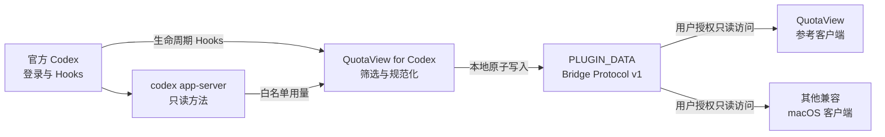

<p align="center">
  
</p>

<h1 align="center">QuotaView for Codex</h1>

<p align="center">
  面向 Codex 脱敏用量与实时任务活动的开源、本地优先数据桥。
</p>

<p align="center">
  <a href="https://github.com/Duoasa/QuotaView-for-Codex/releases/tag/v1.0.0-preview.7"></a>
  <a href="https://github.com/Duoasa/QuotaView-for-Codex/actions/workflows/test.yml"></a>
  
  <a href="LICENSE"></a>
</p>

<p align="center">
  <a href="#installation"><strong>通过 Codex 安装</strong></a>
  ·
  <a href="https://github.com/Duoasa/QuotaView-for-Codex/releases/tag/v1.0.0-preview.7">Preview 7 Release</a>
  ·
  <a href="#privacy-by-design">隐私</a>
  ·
  <a href="#client-integration">开发客户端</a>
</p>

<p align="center">
  <a href="README.md">English</a> · <strong>简体中文</strong>
</p>

<a id="installation"></a>

## 安装

普通用户不需要打开终端。将下面的完整提示词复制到一个新的 Codex 聊天窗口，Codex 会
使用内置插件管理命令添加 Git Marketplace、安装插件，并告诉你仍需亲自确认的步骤。

> [!IMPORTANT]
> 本项目通过第三方自定义 Git Marketplace 分发，并非 OpenAI 官方插件市场条目。安装
> 不会绕过命令审批、Hooks 信任或 macOS 目录选择器。

### 1. 确认运行环境

- 支持插件与 Hooks 的 Codex
- 已完成 Codex 官方登录
- macOS 14 或更高版本
- QuotaView，或其他兼容 Bridge Protocol v1 的 macOS 客户端

### 2. 发送安装提示词

```text
请直接帮我安装 QuotaView for Codex 插件，不要只提供操作说明，也不要让我打开终端。

安装目标：
- Git Marketplace：Duoasa/QuotaView-for-Codex
- 插件：quotaview@quotaview-preview

请按以下要求执行并验证：
1. 使用 Codex 内置的插件管理命令检查当前已经配置的 Marketplace。
2. 如果尚未配置此 Marketplace，添加 Duoasa/QuotaView-for-Codex；如果已经配置为 Git 来源，刷新它的 Git Marketplace 快照；如果同名 Marketplace 当前来自本地目录，不要自动覆盖，先报告当前状态并询问我是保留本地来源还是替换为 Git 来源。
3. 检查 quotaview@quotaview-preview 是否已经安装。如果尚未安装，直接安装；如果已经安装，不要卸载、重装或删除数据，只报告当前状态和版本。
4. 只使用 codex plugin 与 codex plugin marketplace 提供的命令。不要手工编辑 ~/.codex，不要手动复制插件文件，也不要绕过 Hooks 信任。
5. 安装后确认 Codex 能识别 QuotaView for Codex，并报告插件版本。不要读取或输出登录凭据、插件数据内容或完整本地路径。
6. 最后明确告诉我安装是否成功、是否需要重启 Codex，以及重启后如何在设置中完成 Hooks 的 Review / Trust all。Hooks 信任必须由我本人确认。

如果执行命令或访问 GitHub 需要授权，请直接发起对应的授权请求，等待我确认后继续。
```

只批准 Codex 自带的插件管理操作。安装完成后，完全退出并重新打开 Codex。

### 3. 授权 Hooks

打开 `设置 → 插件 → QuotaView for Codex`，展开 `Hooks`，点击 `检查 / Review`，然后
选择 `全部信任 / Trust all`。如果没有合并操作，请进入 `设置 → Hooks`，确认以下 Hook
已启用并显示为 `trusted`：

`SessionStart` · `SessionEnd` · `UserPromptSubmit` · `PreToolUse` · `PostToolUse` · `Stop`

授权后再次完全退出并重新打开 Codex，使受信任的 `SessionStart` Hook 生效。

### 4. 连接客户端

QuotaView 用户可以发送：

```text
Connect QuotaView to Codex.
```

插件会打开 QuotaView 配对流程。请在 macOS 目录选择器中确认 `PLUGIN_DATA` 文件夹，并
只授予 QuotaView 只读访问权限。Hooks 信任和目录访问是两项独立权限，都由用户控制。

### 5. 确认连接

开始一个新的 Codex 任务，确认客户端收到插件版本 `1.0.0-preview.7`、脱敏用量快照、
生命周期事件和最终 `Stop` 事件。也可以发送：

```text
Check my QuotaView plugin connection.
```

> [!NOTE]
> QuotaView 是参考客户端。其他应用可以实现自己的配对界面，并在用户授予只读目录权限
> 后消费同一份 Bridge Protocol v1 数据。

## 为什么使用 QuotaView for Codex

QuotaView for Codex 将 Codex 支持的用量摘要和生命周期 Hooks 转换为小型、版本化的本地
数据合同。它只负责提供数据，不规定客户端如何展示。

| | |
| --- | --- |
| **本地优先** | 将有界数据集写入插件自己的 `PLUGIN_DATA` 目录，不需要云端中继或外部服务。 |
| **只读设计** | 只使用官方本地 `codex app-server` 的两个只读方法，不修改 Codex 账号。 |
| **实时任务活动** | 为状态界面、通知、菜单栏工具、Widget 和灵动岛提供脱敏任务生命周期事件。 |
| **客户端无关协议** | QuotaView 是参考实现，任何兼容 macOS 客户端都可以消费 Bridge Protocol v1。 |
| **隐私保护** | 不保存提示词、命令、工具输入输出、文件内容、模型回复、推理、凭据或原始响应。 |
| **Fail-open** | Bridge 故障不会阻塞 Codex 任务，也不会要求模型继续执行。 |

## 工作原理



Codex 负责登录以及 `codex app-server` 所需的网络访问。插件不读取认证文件、不保存 Token，
也不直接发起 HTTP 请求。

## 提供的数据

| 数据组 | 白名单字段 | 来源 |
| --- | --- | --- |
| 方案与额度窗口 | 方案类型、已用比例、窗口时长、重置时间 | `account/rateLimits/read` |
| Credits 与限制 | `hasCredits`、`unlimited`、余额、是否触达限制 | `account/rateLimits/read` |
| Token 摘要 | 累计 Token 和最新每日 Token 桶 | `account/usage/read` |
| 生命周期 | 事件类型、UTC 时间、协议/结构版本、单调序号 | Codex Hooks |
| 活动上下文 | 会话/Turn 单向哈希、工作区末级目录名、粗粒度工具类别、会话启动来源 | Codex Hooks |
| Bridge 健康 | 插件/协议版本、安装身份、能力、最近写入和序号 | 本地 Bridge |

生命周期事件只保留最新 512 条。工作区数据仅保留末级目录名，最长 80 字符。工具名称在
写入前会归并为 `shell`、`fileEdit`、`mcp`、`subagent`、`localTool` 或 `unknown`。

## 接口

### Codex Hooks

| Hook | Bridge 行为 |
| --- | --- |
| `SessionStart` | 记录启动或恢复上下文，并可能刷新过期用量快照 |
| `SessionEnd` | 记录 Codex 会话结束 |
| `UserPromptSubmit` | 记录新的 Turn，但不复制提示词正文 |
| `PreToolUse` | 工具执行前记录粗粒度工具类别 |
| `PostToolUse` | 工具执行后记录粗粒度工具类别 |
| `Stop` | 记录完成、返回受支持的空 JSON Hook 结果，并可能刷新用量 |

### 只读 app-server 方法

| 方法 | 用途 |
| --- | --- |
| `account/rateLimits/read` | 提供白名单方案、额度窗口、Credits 和限制字段 |
| `account/usage/read` | 提供累计 Token 和最新每日 Token 桶 |

这些是插件到 Codex 的本地调用，不是公开 HTTP 接口。原始响应不会落盘。

### Bridge 操作

| 操作 | 参数 | 行为 |
| --- | --- | --- |
| 配对 QuotaView | `--pair` | 初始化元数据、尽可能刷新用量并打开 QuotaView 配对 URL |
| 诊断 | `--diagnose` | 报告协议/插件版本，以及本地事件和用量是否可用 |
| 刷新用量 | `--refresh-usage` | 请求新的白名单快照；内置 Skill 可以强制立即刷新 |
| 写入生命周期 | Hook 名称 | 写入一条脱敏、单调递增的事件信封 |

## 调用插件

推荐通过 Codex 自然语言调用：

| 目的 | 示例提示词 |
| --- | --- |
| 配对 QuotaView | `Connect QuotaView to Codex.` |
| 诊断 | `Check my QuotaView plugin connection.` |
| 解释本地数据 | `Explain what QuotaView Codex data stores.` |
| 强制刷新用量 | `Refresh my QuotaView usage snapshot now.` |

在有效插件上下文中，开发者可以不硬编码安装路径，直接调用 Bridge：

```sh
"${PLUGIN_ROOT:-${CODEX_PLUGIN_ROOT:-${CLAUDE_PLUGIN_ROOT}}}/scripts/quotaview-bridge" --diagnose
```

如需仅对本次请求跳过五分钟刷新窗口：

```sh
QUOTAVIEW_USAGE_REFRESH_FORCE=1 \
"${PLUGIN_ROOT:-${CODEX_PLUGIN_ROOT:-${CLAUDE_PLUGIN_ROOT}}}/scripts/quotaview-bridge" --refresh-usage
```

## 本地数据协议

插件只在自己的 `PLUGIN_DATA` 目录内写入：

| 文件 | 关键字段 | 客户端说明 |
| --- | --- | --- |
| `bridge.json` | `pluginId`、插件/协议/结构版本、`installationIdentifier`、`createdAt`、能力 | 首先校验；当前能力为 `codex-activity-events` 和 `codex-usage-snapshot` |
| `usage.json` | 采集时间/来源、方案、主要窗口、Credits、限制状态、Token 摘要 | 仅在协议和安装身份与 `bridge.json` 一致时消费 |
| `status.json` | 协议、安装身份、`latestSequence`、最近成功写入、诊断状态 | 用于发现最新事件和 Bridge 健康状态 |
| `events/*.json` | 协议、安装身份、序号、脱敏活动载荷 | 不可变、补零命名、单调递增，只保留最新 512 条 |

每份用量、状态和事件记录都绑定到 `bridge.json` 发布的随机
`installationIdentifier`。兼容客户端应保存本地 `installationIdentifier + sequence`
游标，并在安装身份变化时重置。

<a id="client-integration"></a>

## 客户端接入

Bridge Protocol v1 客户端应当：

1. 要求用户选择并授权插件 `PLUGIN_DATA` 目录；
2. 校验 `bridge.json`、支持的协议/结构版本、安装身份和必要能力；
3. 仅在安装身份与 Bridge 清单一致时读取 `usage.json`；
4. 读取 `status.json` 并按序号消费事件；
5. 将游标保存在客户端中，而不是插件目录；
6. 安装身份变化时重置状态；
7. 对文件大小、时间偏移、过期数据、未知结构和已轮转缺失事件设置边界；
8. 不得写入、删除或修改 `PLUGIN_DATA` 内的权限。

`quotaview://pair` URL 属于 QuotaView 参考客户端。其他客户端可以实现自己的配对界面，
同时消费相同的本地文件合同。

## 刷新行为

- 默认用量刷新间隔为五分钟；
- 当上一份快照足够旧时，`SessionStart` 和 `Stop` 在当前进程内刷新；
- 高频生命周期事件共用刷新窗口，不重复启动 app-server 工作；
- 明确的强制刷新仅对本次请求跳过年龄检查；
- 事件先于可选用量刷新写入，避免缓慢用量读取导致完成事件丢失。

<a id="privacy-by-design"></a>

## 隐私设计

插件**不会**保存：

- 提示词、对话内容、模型回复或推理；
- 命令、工具输入输出、完整路径或文件内容；
- 账号标识、邮箱、Token、Cookie、凭据或认证文件；
- 重置额度库存或原始 app-server 响应。

数据目录使用仅用户可访问权限和原子文件替换。Hooks 信任不会被绕过，客户端必须通过
macOS 目录选择器获得用户明确授权。详见 [PRIVACY.md](PRIVACY.md) 和
[SECURITY.md](SECURITY.md)。

## 要求与限制

- macOS 14 或更高版本
- 支持插件、Hooks 和本地 `codex app-server` 的 Codex
- 用量快照需要 Codex 官方登录
- Bridge Protocol v1 当前面向本地只读 macOS 客户端
- QuotaView 配对使用 QuotaView 专属 URL scheme；其他客户端提供自己的界面
- 插件仍处于 Preview 阶段，插件和 app-server 结构可能继续演进

## 卸载

1. 先在 QuotaView 或其他客户端中断开数据目录；
2. 再在 Codex 中禁用或卸载 `quotaview`；
3. 是否清理保留的本地数据必须由用户另行明确决定。

插件不会代替用户删除数据目录、修改其他 Codex 设置，也不会检查 QuotaView 购买状态。

## 构建与测试

运行确定性 Bridge 测试和隔离安装检查：

```sh
python3 -m json.tool plugins/quotaview/.codex-plugin/plugin.json >/dev/null
python3 -m json.tool plugins/quotaview/hooks.json >/dev/null
python3 -m json.tool .agents/plugins/marketplace.json >/dev/null
zsh -n plugins/quotaview/scripts/quotaview-bridge tests/test-bridge.zsh
zsh tests/test-bridge.zsh
zsh scripts/check-clean-install.zsh
git diff --check
```

不可变 Tag、确定性源码资产和公开资产复验流程见 [RELEASING.md](RELEASING.md)。

## 反馈与贡献

欢迎通过 [GitHub Issues](https://github.com/Duoasa/QuotaView-for-Codex/issues) 提交聚焦的
Bug、兼容性报告和客户端接入建议。请勿在 Issue 中包含凭据、Token 或未脱敏的 Codex
配置。

基于 [MIT License](LICENSE) 发布。
